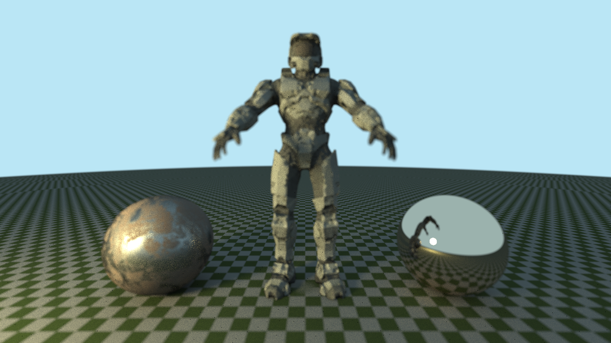

# sexy-raytracer

Ray tracing project for fun and my personal learning. Based on the books by Peter Shirley (https://raytracing.github.io/).

I expanded the project by adding features oriented towards a production environment, like support for triangle primitives, normal maps, and a proper PBR BRDF.

PBR used here is the metallic-roughness model from UE:
https://cdn2.unrealengine.com/Resources/files/2013SiggraphPresentationsNotes-26915738.pdf

which is based on Disney:
https://media.disneyanimation.com/uploads/production/publication_asset/48/asset/s2012_pbs_disney_brdf_notes_v3.pdf

The Master Chief model is from Halo 2 and does not have a metallic/roughness map, but the left globe (sourced from https://freepbr.com/) does.

To build (in Linux):

- Clone the repo
- git submodule init
- git submodule update
- cd into ./glad and ./glfw then (for each):
-   mkdir build && cd build
-   cmake ..
-   make
- cd .. (back to project root dir)
- mkdir build && cd build
- cmake ..
- make

Then run ./sexy-raytracer, which will output a .png file for the final result. To boost quality, you can edit the resolution and number of samples/bounces in main.cpp.
